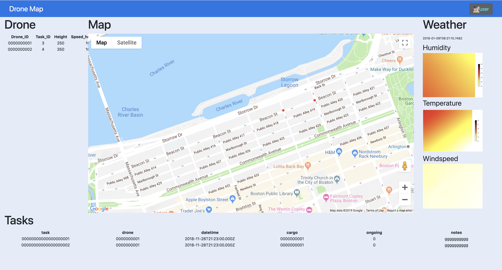

# Future Drones Control System
## Introduction
### Overview
This web built on Node.js is aimed to demo how the drones flying in the system.
### Functions
* Login And Signup
* Add Tasks
* See Drones Track Which Belong to The Company
### Technologies
* Login And Signup -- Use Node ACL for access control, use MD5 as password protection.
* Database -- MySQL Database. Use procedures to easily add record. Use **AWAIT** to wait until the database returns results.
* Track -- Use Google Map API to see actual position of the drone.
## Demo
 .
